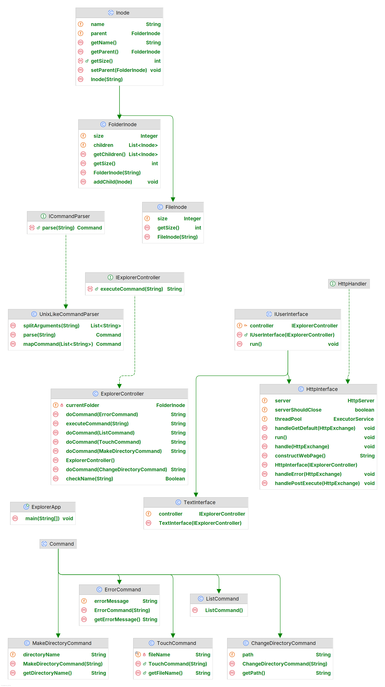

# Explorateur de fichier


# Explorateur de fichier


## Utilisation

### Pour ouvrir l'explorateur dans un terminal :

```bash
  java com.esiea.pootd2.ExplorerApp text
```

### Pour ouvrir l'explorateur dans un navigateur web :

```bash
  java com.esiea.pootd2.ExplorerApp http
```

Puis aller sur http://localhost:8001/

## Commandes disponibles
| Commande | Description |
|----------|-------------|
| `ls`     | Liste les inodes du dossier courant |
| `cd <chemin>` | Change le dossier courant avec le chemin passé en argument |
| `mkdir <nom>` | Crée le dossier avec le nom passé en argument |
| `touch <nom>` | Crée le fichier avec le nom passé en argument |


## Diagramme UML
